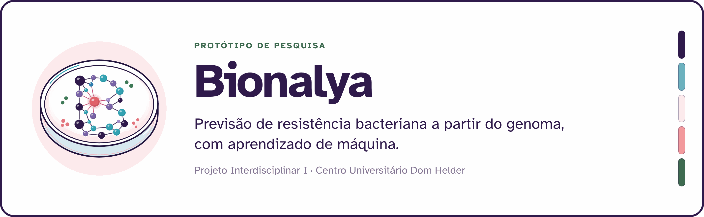
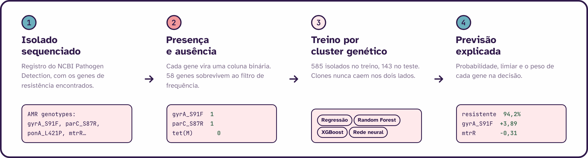
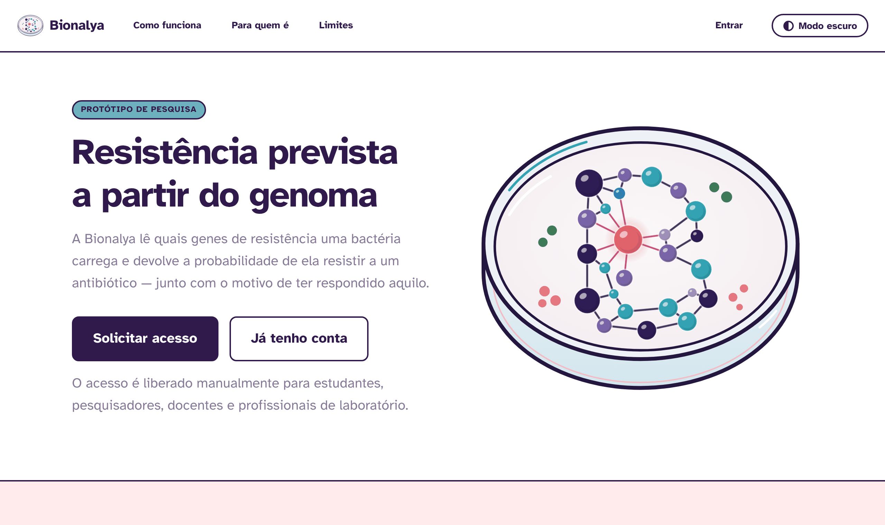
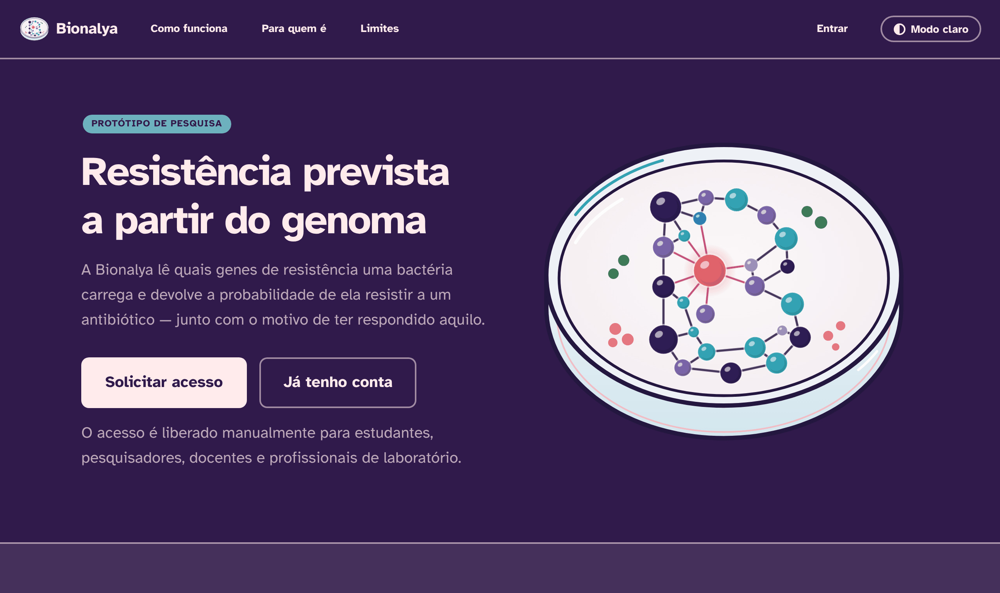

<p align="center">
  <picture>
    <source media="(prefers-color-scheme: dark)" srcset="imagens/banner-escuro.png">
    
  </picture>
</p>

<p align="center">
  
  
  
  
</p>

---

Quando uma bactéria resiste ao antibiótico escolhido, o tratamento certo só começa
depois que o laboratório devolve o antibiograma — e isso costuma levar de 24 a 72 horas.
A **Bionalya** testa uma pergunta mais curta: dá para prever esse resultado olhando só
para os **genes de resistência** que apareceram no sequenciamento da bactéria?

Este repositório tem as duas metades do projeto: o **pipeline de dados e os modelos**
(notebook) e a **plataforma** que vai servir essas previsões (telas em HTML e CSS).

> [!WARNING]
> **Protótipo acadêmico, sem validação clínica.** Nada aqui é diagnóstico e nada
> substitui o antibiograma. O modelo foi treinado com uma única espécie e um único
> antibiótico, e pode errar — inclusive prevendo "sensível" para uma bactéria resistente.

---

## Como funciona

<p align="center">
  <picture>
    <source media="(prefers-color-scheme: dark)" srcset="imagens/fluxo-escuro.png">
    
  </picture>
</p>

O passo que mais mudou o projeto foi o **3**. Numa primeira versão a separação entre
treino e teste era aleatória, e o modelo chegava a AUC 1,000 — bom demais para ser
verdade. O motivo: bactérias são clonais, então cópias quase idênticas do mesmo isolado
caíam dos dois lados e o modelo só precisava reconhecê-las. Trocando para separação por
**cluster genético** (`GroupShuffleSplit` e `StratifiedGroupKFold`), o número caiu para
o patamar honesto que está na tabela abaixo.

## Resultados

Espécie *Neisseria gonorrhoeae*, antibiótico ciprofloxacino, 728 isolados usáveis
(585 no treino, 143 no teste) e 58 genes como variáveis.

| Modelo | AUC | Sensibilidade | Especificidade | Falsos negativos |
|---|---|---|---|---|
| Redes Neurais | **0,994** | 98,9% | 98,2% | 1 de 88 |
| Random Forest | 0,992 | 98,9% | 96,4% | 1 de 88 |
| Regressão Logística | 0,990 | 98,9% | 96,4% | 1 de 88 |
| XGBoost | 0,981 | 98,9% | 96,4% | 1 de 88 |

A meta definida no início do projeto, a partir da literatura, era AUC de 0,85.
A validação cruzada em cinco repetições, sempre respeitando os clusters, ficou entre
0,985 e 0,989 — ou seja, o resultado não veio de uma divisão de sorte.

O gene que mais pesa é o `gyrA_S91F` (36% da importância no Random Forest), seguido de
`gyrA_D95A` e `parC_S87R`. Isso bate com a biologia: **gyrA** e **parC** codificam as
enzimas que o ciprofloxacino ataca, e mutações nelas são o mecanismo conhecido de
resistência a quinolonas. O modelo não inventou um atalho — ele encontrou o mecanismo.

## A plataforma

| Modo claro | Modo escuro |
|---|---|
|  |  |

Oito telas em HTML e CSS puros, sem biblioteca e sem build — é só abrir
`plataforma/inicio.html` no navegador. O único JavaScript são as ~45 linhas que fazem
o botão de modo escuro funcionar.

A identidade usa cinco cores fixas (roxo `#301A4B`, azul `#6DB1BF`, rosa-claro
`#FFEAEC`, rosa `#F39A9D` e verde `#3F6C51`) e a fonte **Atkinson Hyperlegible**,
desenhada pelo Braille Institute para baixa visão. Todo texto passa no mínimo de
4,5:1 da WCAG AA nos dois modos. Os detalhes de contraste e o contrato sugerido da
API estão em [`plataforma/README.md`](plataforma/README.md).

## Estrutura

```
dados_algoritmos.ipynb   Pipeline completo: importação, limpeza, features, treino e avaliação
dados/                   Base do NCBI (não versionada — veja "Como rodar")
plataforma/              Telas da Bionalya (HTML + CSS)
  inicio.html              Página inicial pública
  login.html  cadastro.html  acesso-pendente.html
  index.html  nova-analise.html  resultado.html  modelos.html
  style.css  tema.js  assets/
imagens/                 Imagens deste README
```

## Como rodar

**1. Baixar a base.** Em [NCBI Pathogen Detection](https://www.ncbi.nlm.nih.gov/pathogens/),
escolha *Neisseria gonorrhoeae*, baixe o CSV de isolados e salve em `dados/`.
O arquivo é grande (~32 MB) e por isso não está versionado — confira que ele tem a
coluna **AMR genotypes** preenchida, que é de onde saem as variáveis.

**2. Preparar o ambiente.**

```bash
python -m venv .venv
.venv\Scripts\activate        # Windows
# source .venv/bin/activate   # Linux / macOS
pip install pandas numpy scikit-learn xgboost matplotlib jupyter jinja2
```

**3. Rodar o notebook.** Abra `dados_algoritmos.ipynb` e execute os blocos em ordem.
Eles param com uma mensagem clara se a coluna esperada não existir, em vez de quebrar
mais adiante.

**4. Ver as telas.** Abra `plataforma/inicio.html` com duplo clique. Não precisa de
servidor.

## Limites conhecidos

- **Uma espécie, um antibiótico.** Hoje só *N. gonorrhoeae* e ciprofloxacino.
- **O ciprofloxacino é o caso mais fácil.** A resistência a ele depende de poucas
  mutações bem conhecidas. Antibióticos com mecanismo multifatorial (betalactâmicos,
  por exemplo) tendem a ser bem mais difíceis de prever.
- **Antibiograma ausente.** Dos 72.503 isolados da base, só 794 têm resultado de
  laboratório registrado. Esse é o gargalo real do projeto, não o modelo.
- **A plataforma ainda não conversa com os modelos.** As telas estão com dados de
  exemplo, com os pontos de integração marcados no HTML.
- **Licença ainda não definida.** Enquanto isso, trate como trabalho acadêmico.

## Equipe

Projeto Interdisciplinar I — Ciência da Computação, Centro Universitário Dom Helder.

| Integrante | Frente |
|---|---|
| Yasmin Lourdes e Silva | Dados, modelos de machine learning e identidade visual |
| Christian Ottero Marques | Back-end e banco de dados |
| Maria Eduarda Souza Maia | Interface e front-end |
| André Vieira Prado | _a definir_ |
| Gabriel Medeiros de Souza | _a definir_ |

## Referências

- NCBI Pathogen Detection — <https://www.ncbi.nlm.nih.gov/pathogens/>
- GBD 2021 Antimicrobial Resistance Collaborators. *Global burden of bacterial
  antimicrobial resistance 1990–2021.* The Lancet, 2024. (4,7 milhões de mortes
  associadas à resistência em 2021)
- Revisão de aprendizado de máquina aplicado à previsão de resistência antimicrobiana.
  *PeerJ*, 2024. <https://doi.org/10.7717/peerj.18213>
  (desempenho relatado na literatura: Random Forest 0,89, XGBoost 0,87, Regressão Logística 0,87)
