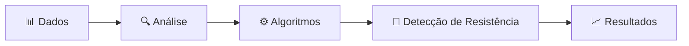

# Detecção de Resistência Bacteriana

Projeto interdisciplinar voltado ao estudo e à **detecção de resistência bacteriana** por meio de dados e algoritmos.

## Sobre o Projeto

Este projeto utiliza dados relacionados à resistência bacteriana para realizar análises e aplicar algoritmos que auxiliam na identificação de padrões presentes nos dados.

## Estrutura do Projeto

```text
Deteccao-resistencia-bateriana/
│
├── dados/
│   └── Dados utilizados no projeto
│
├── dados_algoritmos.ipynb
│   └── Análise dos dados e aplicação dos algoritmos
│
└── README.md
```

## Fluxo



## Tecnologias

* Python
* Jupyter Notebook
* Análise de Dados
* Algoritmos de classificação/análise

## Como Executar

1. Clone o repositório:

```bash
git clone https://github.com/nimsayrosie/Deteccao-resistencia-bateriana.git
```

2. Abra o arquivo `dados_algoritmos.ipynb` no Jupyter Notebook ou Google Colab.

3. Execute as células do notebook para reproduzir a análise.

## Objetivo

O objetivo do projeto é explorar dados relacionados à resistência bacteriana e utilizar métodos computacionais para auxiliar na análise e identificação de padrões.

## Contribuição

Contribuições e sugestões são bem-vindas. Para contribuir, faça um fork do projeto, crie uma branch para sua alteração e abra um Pull Request.

## License

Consulte o repositório para informações sobre a licença.
